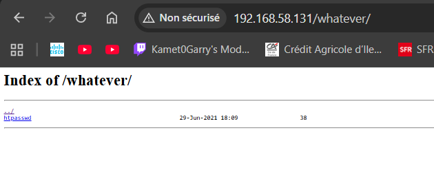
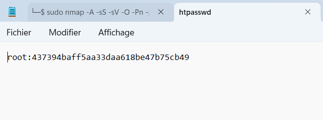
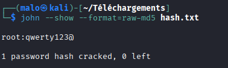
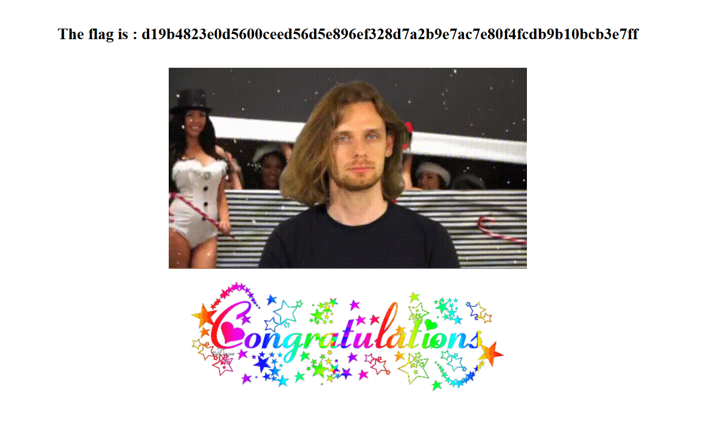

# Brute Force de répertoire

Captures d’écran du challenge **bruteforce / discovery de répertoires** : découverte d’un dossier caché, récupération d’un fichier `.htpasswd`, crack du hash, puis obtention du flag.

## Images (dans l’ordre)

1. **Énumération de contenu web** : scan avec `gobuster dir` pour lister les répertoires accessibles (dont un dossier “whatever”).
   

2. **Accès au dossier découvert** : listing HTTP du répertoire `/whatever/` avec un fichier intéressant (`htpasswd`).
   

3. **Récupération du hash** : contenu du fichier `htpasswd` (login + hash).
   

4. **Crack du hash** : `john` retrouve le mot de passe en clair pour l’utilisateur `root`.
   

5. **Résultat** : page “Congratulations” affichant le flag.
   
