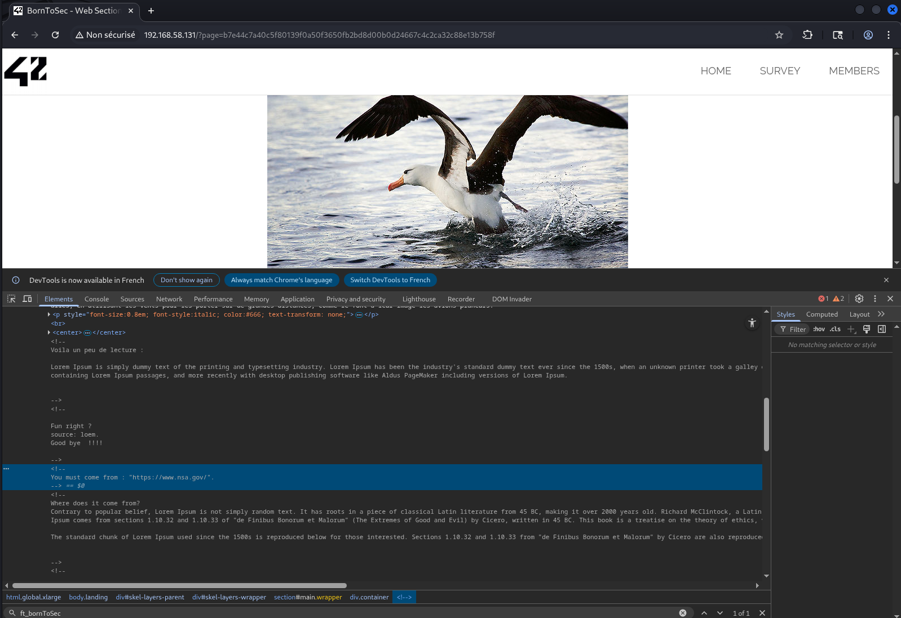
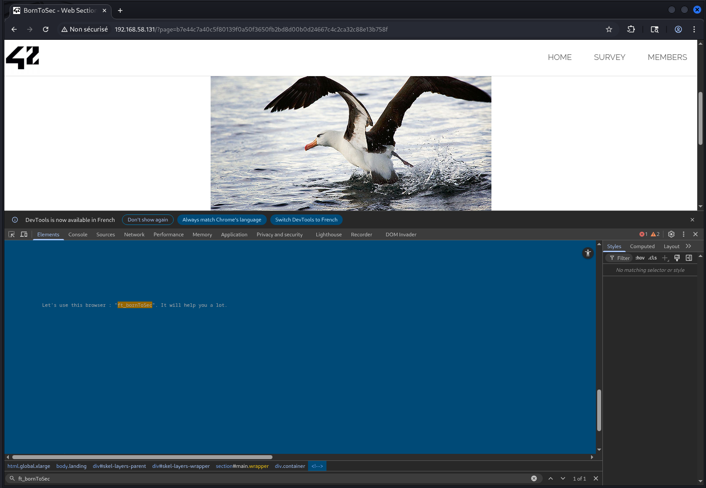
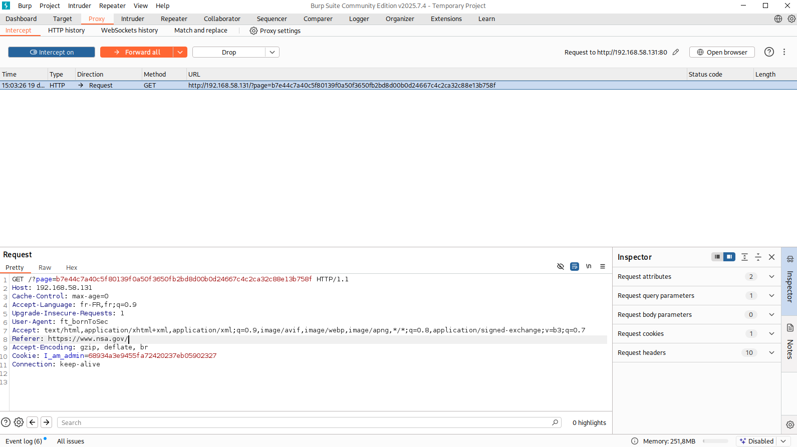
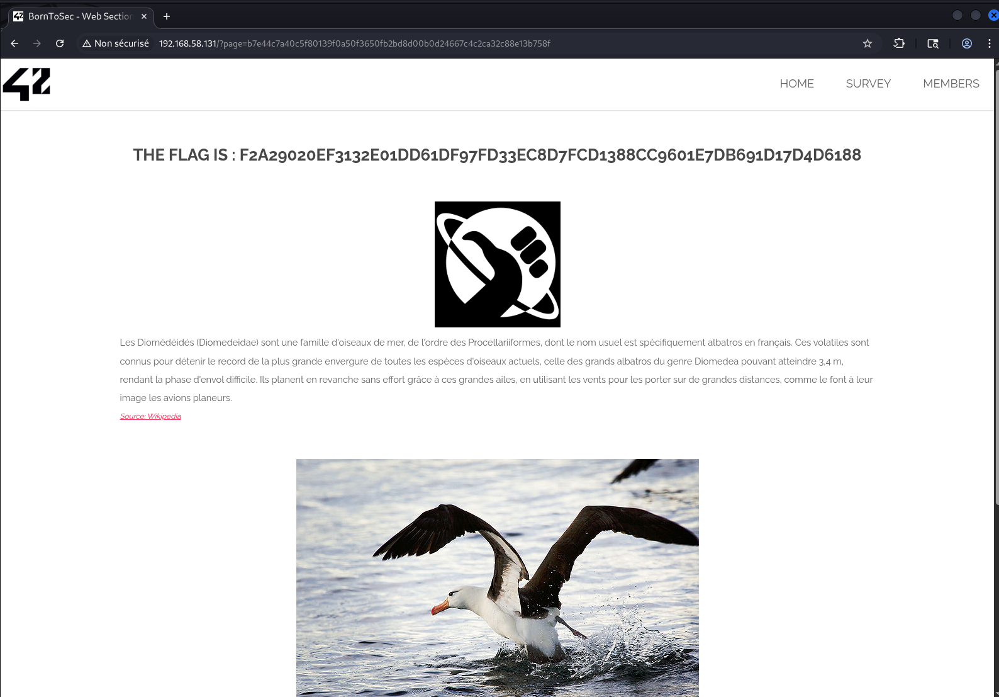

# Cross Site Request Forgery (CSRF)

Captures d’écran du challenge **CSRF** : la ressource n’est accessible que si certaines conditions “navigateur” sont remplies (référent + user-agent). L’idée est de forger la requête (ex. via Burp) pour passer les contrôles.

## Images (dans l’ordre)

1. **Indice dans le code source** : commentaire indiquant que la requête doit provenir de `https://www.nsa.gov/` (contrôle du header `Referer`).
   

2. **Deuxième indice** : commentaire suggérant un navigateur / user-agent spécifique (`ft_bornToSec`).
   

3. **Requête forgée** : dans Burp, ajout/modification des en-têtes `Referer` et `User-Agent` pour satisfaire les conditions côté serveur.
   

4. **Résultat** : accès autorisé et flag affiché.
   

## Remédiation

- Ajouter un **token CSRF** (par formulaire / par requête) vérifié côté serveur.
- Activer **SameSite=Lax/Strict** sur les cookies de session (et `Secure` + `HttpOnly`).
- Vérifier **Origin/Referer** pour les actions sensibles (en complément, pas en unique défense).
- Éviter les actions sensibles en GET : utiliser **POST** + re-validation (mot de passe / 2FA) si critique.
- Protéger les endpoints API (CORS maîtrisé, tokens, double-submit cookie si adapté).
