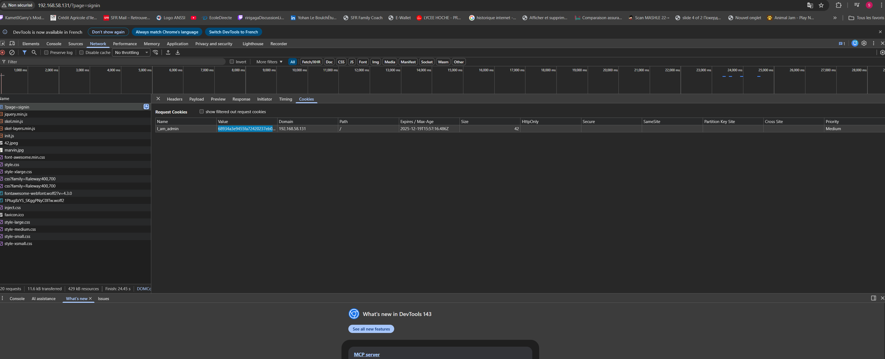
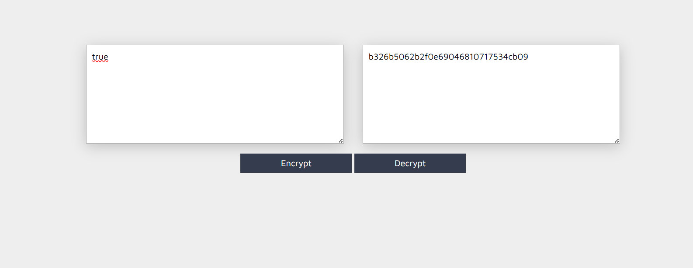
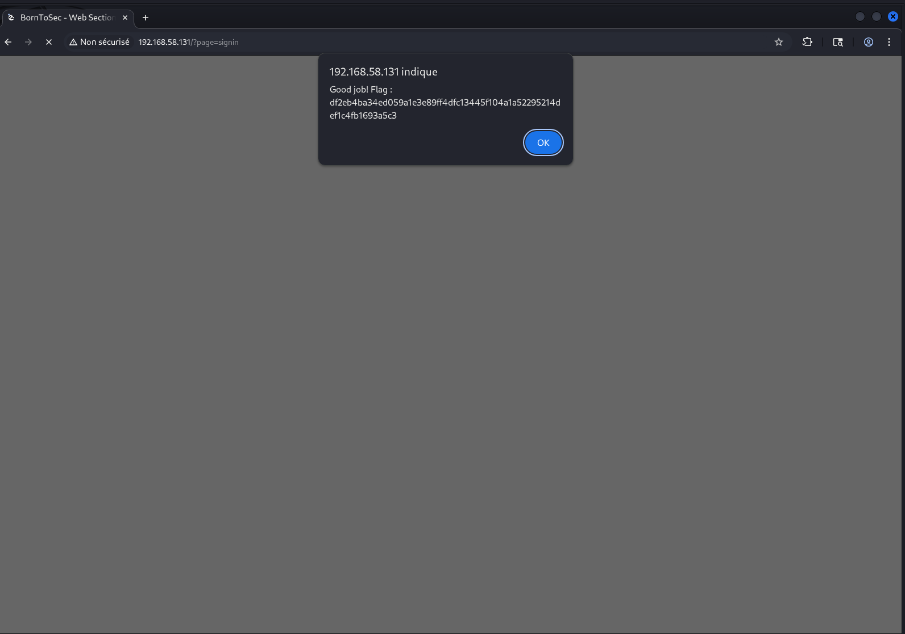

# Exploitation Cookie de session

Captures d’écran du challenge **cookie de session** : un cookie `I_am_admin` contrôle l’accès, mais sa valeur est un hash (MD5) de `true/false`. L’objectif est de remplacer la valeur par le hash correspondant à `true`.

## Images (dans l’ordre)

1. **Observation du cookie** : repérage de `I_am_admin` dans les DevTools (valeur hashée).
   

2. **Identification de la valeur** : la valeur correspond à un MD5, qui se résout en `false`.
   

3. **Premier essai** : modification directe du cookie en `I_am_admin=true` (non hashé) via Burp.
   

4. **Calcul du bon hash** : MD5 de `true` → `b326b5062b2f0e69046810717534cb09`.
   

5. **Injection du cookie correct** : remplacement de `I_am_admin` par le MD5 de `true` dans la requête interceptée.
   

6. **Résultat** : le serveur accepte et renvoie le flag (popup).
   

## Remédiation

- Ne pas stocker un état d’admin “modifiable” côté client : préférer des **sessions côté serveur**.
- Si cookie applicatif nécessaire : utiliser une **signature HMAC** (clé secrète) ou un **JWT signé** (et vérifier côté serveur).
- Cookies de session en **HttpOnly + Secure + SameSite**, rotation régulière, et invalidation à la déconnexion.
- Utiliser des identifiants de session **aléatoires** (CSPRNG), et **regénérer** l’ID après login/élévation de privilège.
- Forcer **HTTPS** et ajouter monitoring/alerting sur changements de privilèges anormaux.
