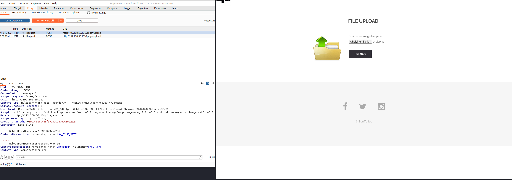
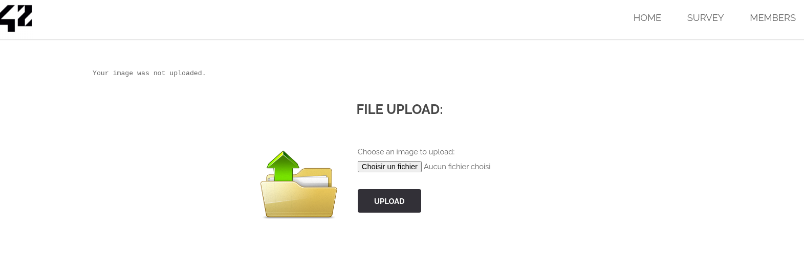
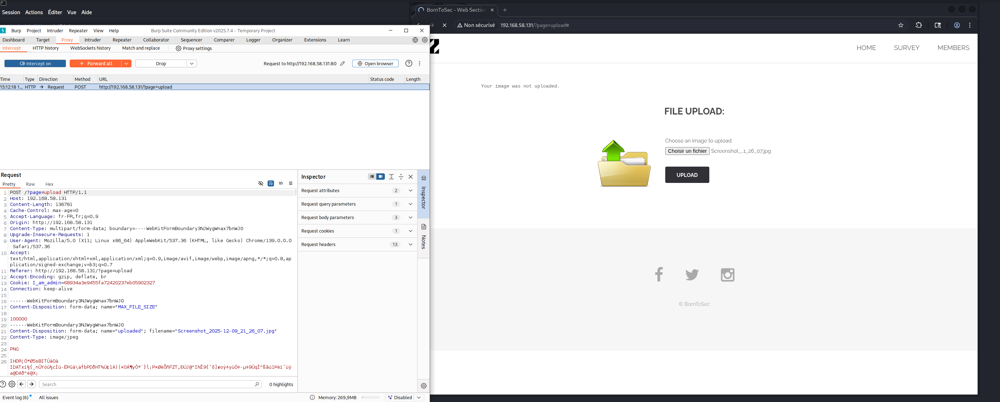
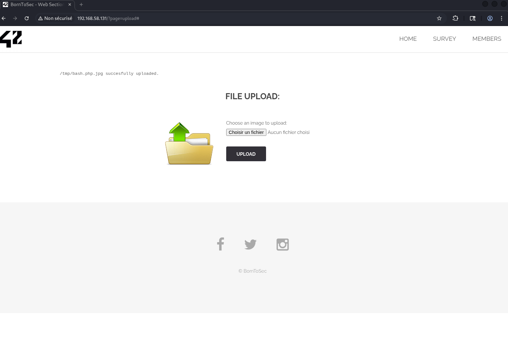
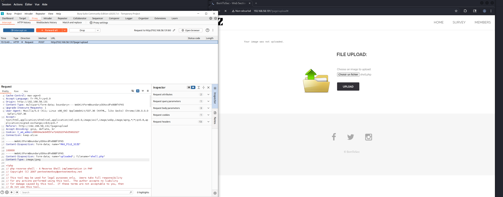
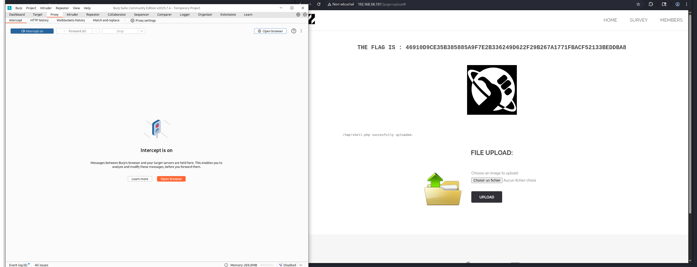

# Faille LFI

Captures d’écran autour d’un challenge “LFI / upload” : tentative d’upload d’un fichier PHP, contournement des filtres (type MIME / extension), puis validation avec obtention du flag.

## Images (dans l’ordre)

1. **Tentative initiale** : upload direct d’un `shell.php` (interception Burp).
   

2. **Blocage** : le site refuse l’upload (message “Your image was not uploaded”).
   

3. **Contournement (double extension)** : envoi d’un fichier ressemblant à une image mais nommé avec une extension double (ex. `bash.php.jpg`), en observant la requête dans Burp.
   

4. **Upload accepté** : confirmation que `/tmp/bash.php.jpg` est bien envoyé.
   

5. **Contournement (type MIME / contenu)** : modification de la requête pour faire accepter un fichier `.php` en le présentant comme une image (`Content-Type: image/jpeg`) tout en gardant du code PHP dans le corps.
   

6. **Résultat** : upload de `/tmp/shell.php` validé, et flag affiché par le challenge.
   
