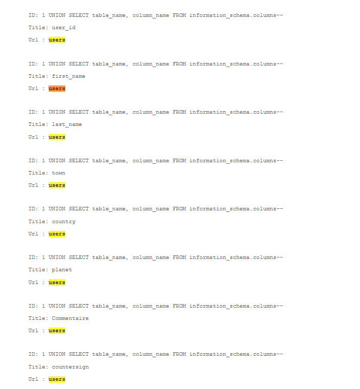
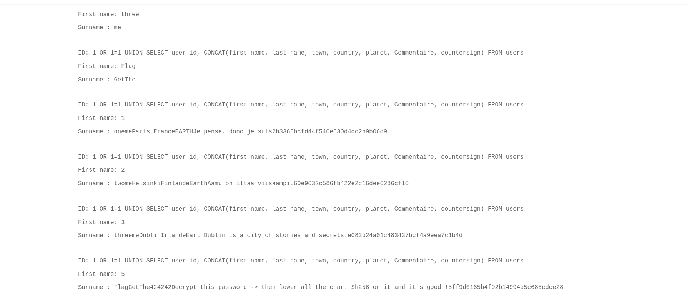

# SQL 1

Captures d’écran du challenge **SQL Injection** (niveau 1) : énumération des colonnes, extraction d’un secret, puis transformation (décryptage/normalisation + SHA-256) pour obtenir le flag.

## Images (dans l’ordre)

1. **Énumération des colonnes** : `UNION SELECT ... FROM information_schema.columns` pour identifier les champs de la table `users`.
   

2. **Dump des données** : `UNION SELECT` + `CONCAT(...)` pour récupérer le contenu pertinent (dont un hash et des instructions).
   

3. **Décryptage du hash** : résolution du MD5 pour retrouver la valeur en clair (`FortyTwo`).
   

4. **Résultat final** : la valeur “FortyTwo” (mise en minuscules selon l’indication) est hashée en SHA-256 → flag affiché.
   

## Remédiation

- Utiliser des **requêtes préparées / paramètres bindés** (ou un ORM) : jamais de concaténation de chaînes dans le SQL.
- Appliquer une **allowlist** sur les champs “dynamiques” (tri, colonne, ordre), sinon mapping côté serveur.
- Compte SQL en **moindre privilège** (pas de droits admin ; séparation lecture/écriture si possible).
- Gérer proprement les erreurs : **pas de messages SQL** en production, et journalisation côté serveur.
- Ajouter de la **détection** (WAF/rate-limit) + tests automatisés (OWASP SQLi).
