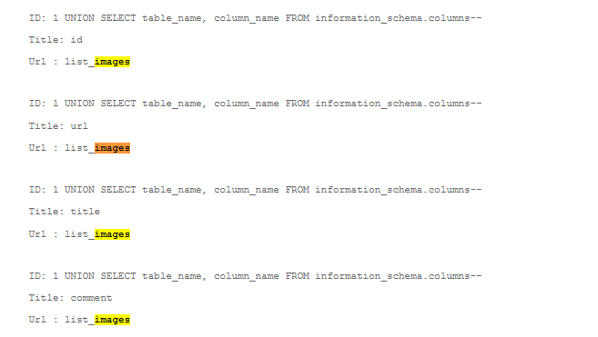
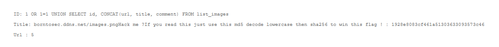
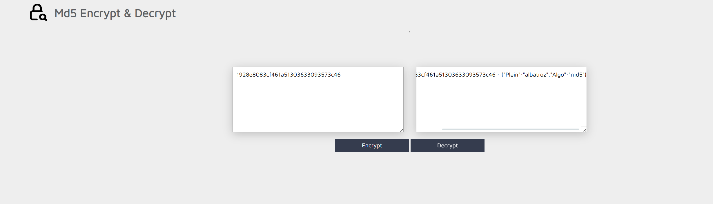
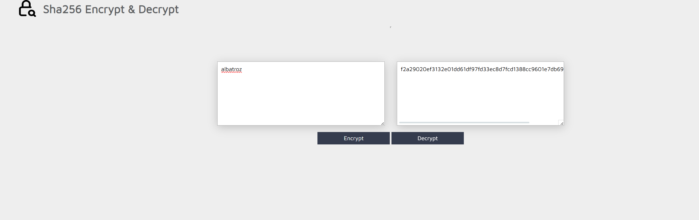

# SQL 2

Captures d’écran du challenge **SQL Injection** (niveau 2) : découverte de table/colonnes, extraction d’un hash MD5, puis conversion en SHA-256 pour obtenir le flag.

## Images (dans l’ordre)

1. **Énumération des colonnes** : `UNION SELECT ... FROM information_schema.columns` révèle la table `list_images` et ses champs.
   

2. **Extraction du hash** : `UNION SELECT` + `CONCAT(...)` récupère un MD5 et une consigne (“md5 decode → lowercase → sha256”).
   

3. **Décryptage du MD5** : récupération du texte en clair (`albatroz`).
   

4. **Calcul du SHA-256** : hash SHA-256 du mot en clair (après mise en minuscules) → résultat utilisé comme flag.
   

## Remédiation

- Utiliser des **requêtes préparées / paramètres bindés** (ou un ORM) : jamais de concaténation de chaînes dans le SQL.
- Appliquer une **allowlist** sur les champs “dynamiques” (tri, colonne, ordre), sinon mapping côté serveur.
- Compte SQL en **moindre privilège** (pas de droits admin ; séparation lecture/écriture si possible).
- Gérer proprement les erreurs : **pas de messages SQL** en production, et journalisation côté serveur.
- Ajouter de la **détection** (WAF/rate-limit) + tests automatisés (OWASP SQLi).
