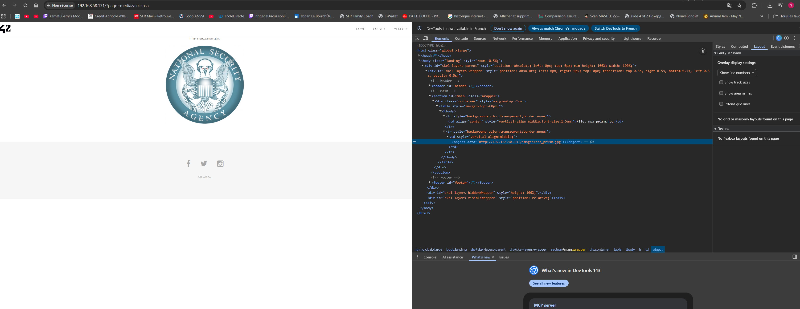
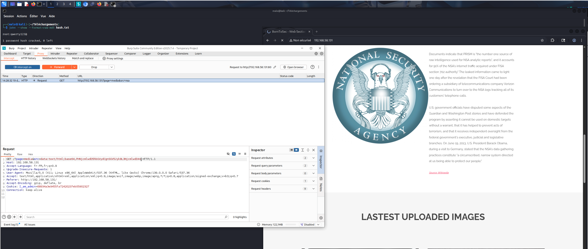
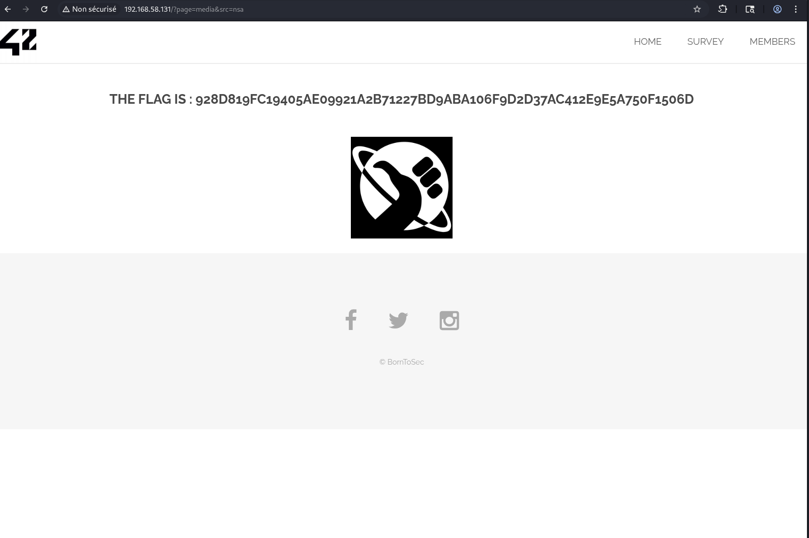

# XSS 2

Captures d’écran du challenge **XSS** (niveau 2) : exploitation d’un paramètre `src` injecté dans une balise d’embed (type `<object>`), permettant d’exécuter du HTML/JS.

## Images (dans l’ordre)

1. **Repérage du point d’injection** : la page charge une ressource via `src` et l’élément HTML montre l’intégration côté client.
   

2. **Exploitation via `data:` URI** : modification du paramètre `src` dans Burp pour injecter un `data:text/html;base64,...` (HTML/JS exécuté par le navigateur).
   

3. **Résultat** : le challenge renvoie le flag après l’exécution de l’injection.
   
